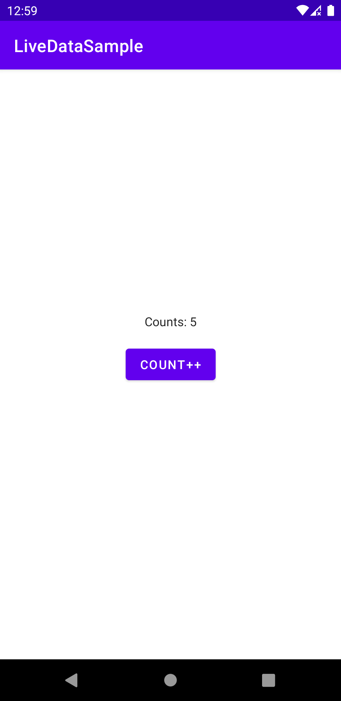

# LiveData Sample
 
 

 ## Overview
 Test about live data (View Models)
 
 ## Use Instructions
 
 * Gradle configuration
 ```Gradle
 def lifecycle_version = "2.4.0-alpha02"
 implementation "androidx.lifecycle:lifecycle-viewmodel-ktx:$lifecycle_version"
 implementation "androidx.lifecycle:lifecycle-livedata-ktx:$lifecycle_version"
 implementation "androidx.lifecycle:lifecycle-runtime-ktx:$lifecycle_version"
 implementation "androidx.activity:activity-ktx:1.3.5"
 implementation "androidx.fragment:fragment-ktx:1.3.5"
 ```
* ViewModel
    * note: Always same pattern.
```
        private val _NAME = MutableLiveData(TYPE)
        val NAME: LiveData<TYPE> get() = _NAME 
```
```kotlin
class MainViewModel : ViewModel() {
    
    private val _count = MutableLiveData(0)
    val count: LiveData<Int> get() = _count 

    //Function that interact with private mutable livedata
    fun incrementCount() {
        _count.value = _count.value?.plus(1) ?: 1
    }
}
```

* Activity using ViewModel
    ```kotlin
    class MainActivity : AppCompatActivity() {
    
        private val vm by viewModels<MainViewModel>()
    
        @SuppressLint("SetTextI18n")
        override fun onCreate(savedInstanceState: Bundle?) {
            super.onCreate(savedInstanceState)
            val binding = ActivityMainBinding.inflate(layoutInflater)
            setContentView(binding.root)
    
            binding.button.setOnClickListener { vm.incrementCount() }
    
            vm.count.observe(this, Observer {
                binding.textView.text = "Counts: $it"
            })
        }
    }
    ```
___
For preserve state livedata, we can do:
___
* Using saveStateHandle passed as parameter (option 1) 
```
    class MainViewModel(private val state: SavedStateHandle) : ViewModel() {
        
        private val _count = MutableLiveData(state["count"] ?: 0)
        val count: LiveData<Int> get() = _count
    
    
        fun incrementCount() {
            _count.value = _count.value?.plus(1) ?: 1
            state["count"] = _count.value
        }
    }
```
* Using saveStateHandle passed as parameter (option 2 - easiest) 
```
    class MainViewModel(state: SavedStateHandle) : ViewModel() {
        
        private val _count = state.getLiveData("count",0)
        val count: LiveData<Int> get() = _count
    
    
        fun incrementCount() {
            _count.value = _count.value?.plus(1) ?: 1
        }
    }
```


